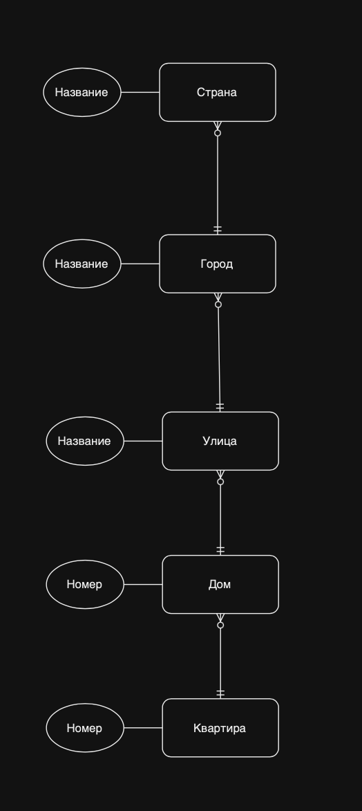

# Домашнее задание 2
Хамид Карим

---

Не совсем понял, что конкретно сдавать, поэтому есть и код, и картинка.

---

## Задание 1
```uml
@startuml

entity Book {
  * ISBN: text
  ---
  year: number
  name: text
  author: text
  publisher_id: number <<FK>>
  pages_amount: number
}

entity Publisher {
  * uuid: UUID <<generated>>
  ---
  name: text
  address: text
}

entity Copy {
  * uuid: UUID <<generated>>
  ---
  * copy_number: number
  * book_isbn: text
  shelf_position: text
}

entity Category {
  * uuid: UUID <<generated>>
  ---
  parent_category_uuid: UUID <<FK>>
  name: text
}

entity Reader {
  * uuid: UUID <<generated>>
  ---
  name: text
  surname: text
  address: text
  burthdate: date
}

entity Borrow {
  * uuid: UUID <<generated>>
  ---
  * copy_uuid: UUID <<FK>>
  * reader_uuid: UUID <<FK>>
  return_date: date
}

Publisher ||--o{ Book: publishes
Book ||--o{ Copy: has
Book }o--|{ Category: categorized
Category |o--o{ Category: has parent category
Reader ||--o{ Borrow: borrowed by
Borrow }o--|| Copy: borrows

@enduml
```
---

- Да, в Copy можно было бы сделать 
```
entity Copy {
  * copy_number: number
  * book_isbn: text
  ---
  shelf_position: text
}
```
, но тогда и ссылаться из Borrow надо на два значения, поэтому я сделал uuid и обязательные поля copy_number и book_isbn
- По факту, Borrow является таблицей M2M связи с доп информацией

@startuml

entity Book {
  * ISBN: text
  ---
  year: number
  name: text
  author: text
  publisher_id: number <<FK>>
  pages_amount: number
}

entity Publisher {
  * uuid: UUID <<generated>>
  ---
  name: text
  address: text
}

entity Copy {
  * uuid: UUID <<generated>>
  ---
  * copy_number: number
  * book_isbn: text
  shelf_position: text
}

entity Category {
  * uuid: UUID <<generated>>
  ---
  parent_category_uuid: UUID <<FK>>
  name: text
}

entity Reader {
  * uuid: UUID <<generated>>
  ---
  name: text
  surname: text
  address: text
  burthdate: date
}

entity Borrow {
  * uuid: UUID <<generated>>
  ---
  * copy_uuid: UUID <<FK>>
  * reader_uuid: UUID <<FK>>
  return_date: date
}

Publisher ||--o{ Book: publishes
Book ||--o{ Copy: has
Book }o--|{ Category: categorized
Category |o--o{ Category: has parent category
Reader ||--o{ Borrow: borrowed by
Borrow }o--|| Copy: borrows

@enduml

## Задание 2

Изначально, так как просили смоделировать только эти схемы, то я на draw.io сделал модели. И для третьего задания я изначально реализовал эти три модели в диаграммы, так как не совсем было ясно, откуда брать модель для реализации в третьем. Но раз сделал, оставлю уже.



### Пункт 1

Тут связи все mandatory, так как по заданию дом уже стоит, поэтому хотя бы одна связь должна быть.
```
@startuml
entity Flat {
  * id: number <<generated>>
  ---
  house_id: numebr <<FK>>
  number: number
}
entity House {
  * id: number <<generated>>
  ---
  street_id: number <<FK>>
  number: number
}
entity Street {
  * id: number <<generated>>
  ---
  town_id: number <<FK>>
  name: text
}
entity Town {
  * id: number <<generated>>
  ---
  country_id: number <<FK>>
  name: text
}
entity Country {
  * id: number <<generated>>
  ---
  name: text
}

Flat }|--|| House: located
House }|--|| Street: located
Street }|--|| Town: located
Town }|--|| Country: located
@enduml
```
@startuml
entity Flat {
  * id: number <<generated>>
  ---
  house_id: numebr <<FK>>
  number: number
}
entity House {
  * id: number <<generated>>
  ---
  street_id: number <<FK>>
  number: number
}
entity Street {
  * id: number <<generated>>
  ---
  town_id: number <<FK>>
  name: text
}
entity Town {
  * id: number <<generated>>
  ---
  country_id: number <<FK>>
  name: text
}
entity Country {
  * id: number <<generated>>
  ---
  name: text
}

Flat }|--|| House: located
House }|--|| Street: located
Street }|--|| Town: located
Town }|--|| Country: located
@enduml

### Пункт 2
Тут, естественно, некоторые связи могли быть не обязательными, но по заданию, матч уже идет, поэтому некоторые связи жесткие.

```
@startuml

entity Player {
  * id: number <<generated>>
  ---
  team_id: number <<FK>>
  name: text
  birthdate: date
}

entity Team {
  * id: number <<generated>>
  ---
  name: text
}

entity Referee {
  * id: number <<generated>>
  ---
  name: text
  experience: number
}

entity Match {
  * date: date
  location: text
  ---
  * team1_id: number
  * team2_id: number
  * referee_id: number
}

Team ||--|{ Player: has
Match ||--|| Team: played_by_1_team
Match ||--|| Team: played_by_2_team
Match ||--|| Referee: officiated_by

@enduml
```
@startuml

entity Player {
  * id: number <<generated>>
  ---
  team_id: number <<FK>>
  name: text
  birthdate: date
}

entity Team {
  * id: number <<generated>>
  ---
  name: text
}

entity Referee {
  * id: number <<generated>>
  ---
  name: text
  experience: number
}

entity Match {
  * date: date
  location: text
  ---
  * team1_id: number
  * team2_id: number
  * referee_id: number
}

Team ||--|{ Player: has
Match ||--|| Team: played_by_1_team
Match ||--|| Team: played_by_2_team
Match ||--|| Referee: officiated_by

@enduml

### Пункт 3
```
@startuml

entity Person {
  * id: number <<generated>>
  ---
  name: text
  birthdate: date
  gender: text
  mother_id: number <<FK>>
  father_id: number <<FK>>
}

Person ||--o{ Person: isMotherOf
Person ||--o{ Person: isFatherOf

@enduml
```
@startuml

entity Person {
  * id: number <<generated>>
  ---
  name: text
  birthdate: date
  gender: text
  mother_id: number <<FK>>
  father_id: number <<FK>>
}

Person ||--o{ Person: isMotherOf
Person ||--o{ Person: isFatherOf

@enduml


## Задание 3

Я тут добавил Enum, потому что мне интересно, как это делается на схемах бд. Потому что, с точки зрения реализации, понимаю что он тут будет, но как его тут показать, интересно будет узнать. Вроде в инете пишут, что так.

```
@startuml

entity Entity {
    * id: number <<generated>>
    ---
    * name: text
}

entity Interaction {
    * id: number <<generated>>
    ---
    * relation_type: RelationType
    * source_entity_id: number <<FK>>
    * target_entity_id: number <<FK>>
    name: text
}

entity Attribute {
    * id: number <<generated>>
    ---
    * entity_id: number <<FK>>
    name: text
    type: text
}

class RelationType <<enumeration>> {
    Zero or One
    Exactly One
    Zero or Many
    One or Many
}

Entity }|--o{ Interaction
Entity ||--o{ Attribute
Interaction ||--|| RelationType

@enduml
```
@startuml

entity Entity {
    * id: number <<generated>>
    ---
    * name: text
}

entity Interaction {
    * id: number <<generated>>
    ---
    * relation_type: RelationType
    * source_entity_id: number <<FK>>
    * target_entity_id: number <<FK>>
    name: text
}

entity Attribute {
    * id: number <<generated>>
    ---
    * entity_id: number <<FK>>
    name: text
    type: text
}

class RelationType <<enumeration>> {
    Zero or One
    Exactly One
    Zero or Many
    One or Many
}

Entity }|--o{ Interaction
Entity ||--o{ Attribute
Interaction ||--|| RelationType

@enduml
