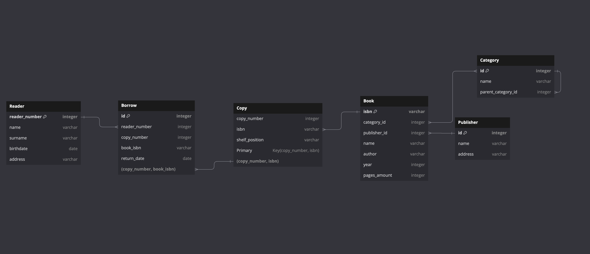
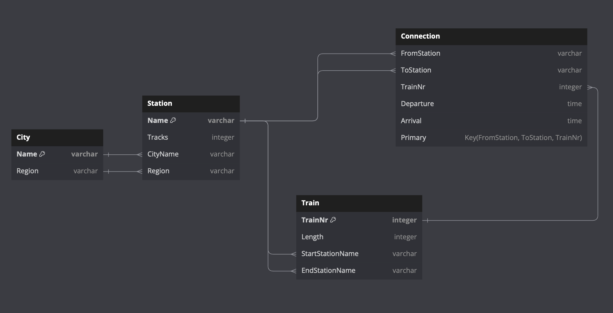
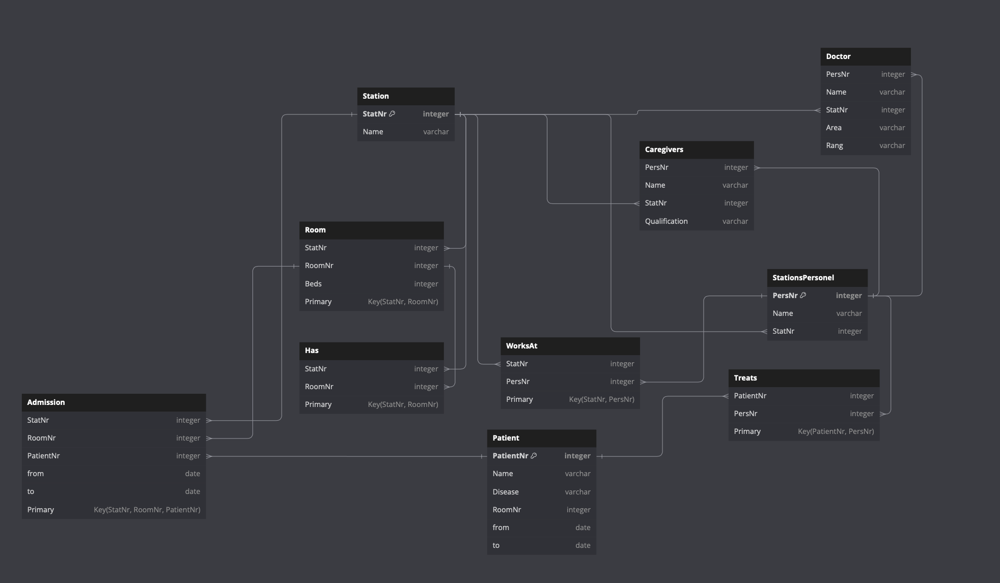
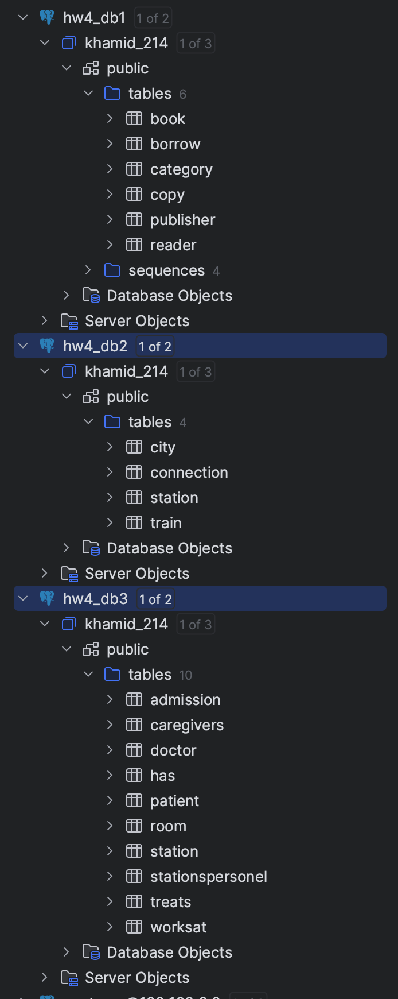

# Домашнее задание 4
Хамид Карим, БПИ214

Все задания делал на `https://dbdiagram.io/d`

## Задание 1

```
Table Reader {
  reader_number integer [primary key, increment]
  name varchar
  surname varchar
  birthdate date
  address varchar
}

Table Borrow {
  id integer [primary key, increment]
  reader_number integer
  copy_number integer
  book_isbn varchar
  return_date date
}
Ref: Borrow.reader_number > Reader.reader_number
Ref: Borrow.(copy_number, book_isbn) > Copy.(copy_number, isbn)

Table Copy {
  copy_number integer
  isbn varchar [ref: > Book.isbn]
  shelf_position varchar
  
  Primary Key(copy_number, isbn)
}

Table Category {
  id integer [primary key, increment]
  name varchar
  parent_category_id integer [null]
}
Ref: Category.parent_category_id > Category.id

Table Book {
  isbn varchar [primary key]
  category_id integer
  publisher_id integer
  name varchar
  author varchar
  year integer
  pages_amount integer
}
Ref: Book.category_id <> Category.id
Ref: Book.publisher_id > Publisher.id

Table Publisher {
  id integer [primary key, increment]
  name varchar
  address varchar
}
```
<!-- ------------------------------------------------------------------------------------------- -->

```
Table City {
  Name varchar [primary key]
  Region varchar
}

Table Station {
  Name varchar [primary key]
  Tracks integer
  CityName varchar [ref: > City.Name]
  Region varchar [ref: > City.Region]
}

Table Train {
  TrainNr integer [primary key]
  Length integer
  StartStationName varchar [ref: > Station.Name]
  EndStationName varchar [ref: > Station.Name]
}

Table Connection {
  FromStation varchar [ref: > Station.Name]
  ToStation varchar [ref: > Station.Name]
  TrainNr integer [ref: > Train.TrainNr]
  Departure time
  Arrival time
  
  Primary Key(FromStation, ToStation, TrainNr)
}
```
<!-- ------------------------------------------------------------------------------------------- -->


```
Table StationsPersonel {
  PersNr integer [primary key]
  Name varchar
  StatNr integer [ref: > Station.StatNr]
}

Table Station {
  StatNr integer [primary key]
  Name varchar
}

Table Doctor {
  PersNr integer [ref: > StationsPersonel.PersNr]
  Name varchar
  StatNr integer [ref: > Station.StatNr]
  Area varchar
  Rang varchar
}

Table Caregivers {
  PersNr integer [ref: > StationsPersonel.PersNr]
  Name varchar
  StatNr integer [ref: > Station.StatNr]
  Qualification varchar
}

Table Patient {
  PatientNr integer [primary key]
  Name varchar
  Disease varchar
  RoomNr integer [null]
  from date [null]
  to date [null]
}

Table Room {
  StatNr integer [ref: > Station.StatNr]
  RoomNr integer
  Beds integer
  
  Primary Key(StatNr, RoomNr)
}

Table WorksAt {
  StatNr integer [ref: > Station.StatNr]
  PersNr integer [ref: > StationsPersonel.PersNr]
  
  Primary Key(StatNr, PersNr)
}

Table Treats {
  PatientNr integer [ref: > Patient.PatientNr]
  PersNr integer [ref: > StationsPersonel.PersNr]
  
  Primary Key(PatientNr, PersNr)
}

Table Admission {
  StatNr integer [ref: > Station.StatNr]
  RoomNr integer [ref: > Room.RoomNr]
  PatientNr integer [ref: > Patient.PatientNr]
  from date
  to date
  
  Primary Key(StatNr, RoomNr, PatientNr)
}

Table Has {
  StatNr integer [ref: > Station.StatNr]
  RoomNr integer [ref: > Room.RoomNr]
  
  Primary Key(StatNr, RoomNr)
}
```

--- 

## Задание 2+3
Сгенерировал нужные скрипты и конфигурационные файлы. В Конфигурационных файлах можно что угодно для настройки прописывать, это я понимаю, но тут важнее всего порты прописать(которые, естественно, можно и в docker-compose.yaml прописать, что с моей точки зрения намного правильнее с точки зрения архитектуры, но да ладно).

Для запуска контейнеров, достаточно прописать 
```
docker compose up --build
```
Для остановки
```
docker compose down -v
```

И вот скрин из DataGrip:

