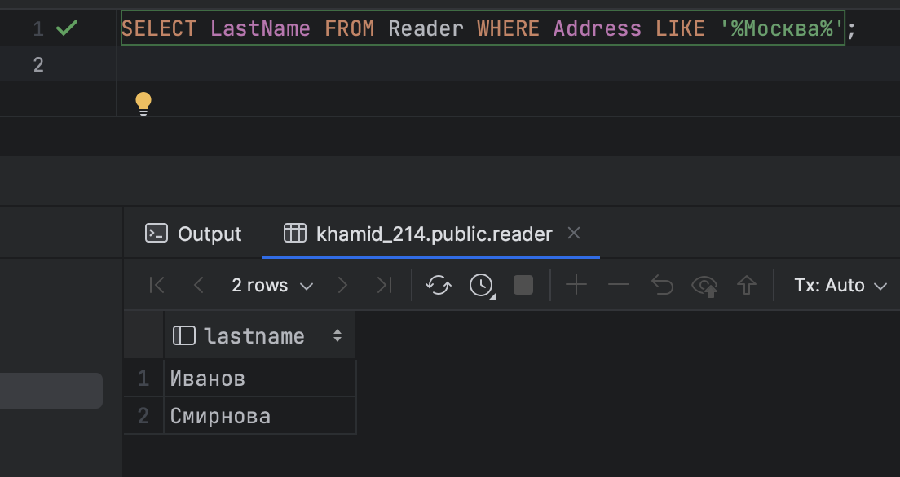

# Домашнее задание 5
Хамид Карим, БПИ214


---
Если вы проверяете сразу мое 4 и это задания вместе, то заметили, что разные таблицы. Таблицы 4 задания сделаны по моим схемам. А для этого задания, я решил сделать стандартно по схемам задания.

Данные таблиц заполняются данными при запуске контейнеров
```
docker compose up -d --build
```

Также, для остановки контейнеров
```
docker compose down -v
```

## Задание 1

### А

```sql
SELECT LastName FROM Reader WHERE Address LIKE '%Москва%';
```
### Б

```sql
SELECT B.Author, B.Title
FROM Book B
JOIN Borrowing BR ON B.ISBN = BR.ISBN
JOIN Reader R ON BR.ReaderNr = R.ID
WHERE R.FirstName = 'Иван' AND R.LastName = 'Иванов';
```

### В

```sql
SELECT B.ISBN
FROM BookCat AS BC
JOIN Book AS B ON BC.ISBN = B.ISBN
WHERE BC.CategoryName = 'Горы' AND B.ISBN NOT IN (SELECT ISBN FROM BookCat WHERE CategoryName = 'Путешествия');
```

### Г

```sql
SELECT R.LastName, R.FirstName
FROM Borrowing AS BR
JOIN Reader AS R ON BR.ReaderNr = R.ID
WHERE BR.ReturnDate IS NOT NULL;
```
### Д

```sql
SELECT DISTINCT R.LastName, R.FirstName
FROM Borrowing AS BR
JOIN Reader AS R ON BR.ReaderNr = R.ID
WHERE BR.ISBN IN (
    SELECT ISBN
    FROM Borrowing
    WHERE ReaderNr = (
        SELECT ID
        FROM Reader
        WHERE FirstName = 'Иван' AND LastName = 'Иванов'
    )
)
AND R.ID != (SELECT ID FROM Reader WHERE FirstName = 'Иван' AND LastName = 'Иванов');
```

## Задание 2

### А

```sql
SELECT * FROM Connection
WHERE FromStation = 'Москва Центральная' AND ToStation = 'Тверская Станция';
```

### Б

```sql
SELECT * FROM Connection
WHERE FromStation = 'Москва Центральная' AND ToStation = 'Санкт-Петербург Главный'
AND DATE(Departure) = DATE(Arrival);
```